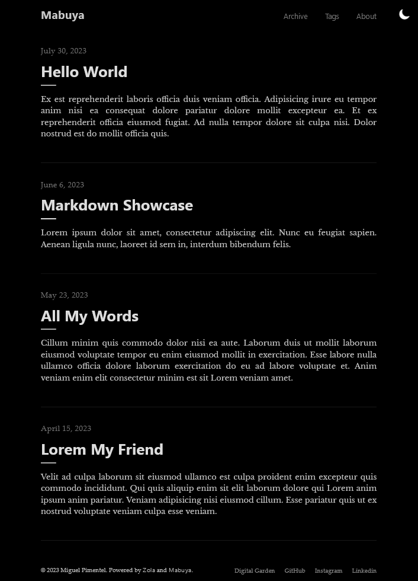
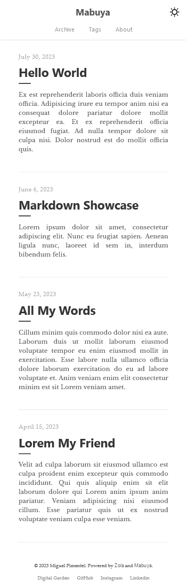

<p align="right">
  
  
  
  
  
</p>

# Mabuya

Mabuya is a minimal Zola theme focused on helping you build an elegant, fast, lightweight, and SEO-ready blog. Put your work front and center with Mabuya as the base of your project.

Check out the live [demo](https://semanticdata.github.io/mabuya/) of the theme.

## Introduction to Mabuya

While searching for themes, I came across [Zola Tale]. Sadly, the project's last update was on Dec 4, 2021. Shortly after, I decided to fork the project and add my own touches to it.

## Where The Name Comes From

The name Mabuya comes from the [Mabuya hispaniolae](https://en.wikipedia.org/wiki/Mabuya_hispaniolae?useskin=vector), a possibly extinct[^1] species of skink endemic to the Dominican Republic, my home country.

## Features and Improvements 

While working on the theme, I have added new functionality and many quality of life improvements. Here's a short non-inclusive list:

- Fully refactored stylesheets.
- Added Dark theme and color scheme toggle.
- Added new footer navigation.
- Created a custom GitHub Action that is faster than any other in GitHub.
- Refined page transitions from desktop to mobile and viceversa.
- Centralized custom variables. Made it easier to make color changes to the site.
- Addressed PR [#7](https://github.com/aaranxu/tale-zola/pull/7).
- Addressed (temporarily) Issue [#1](https://github.com/aaranxu/tale-zola/issues/1).
- Addressed Issue [#4](https://github.com/aaranxu/tale-zola/issues/4).
- Optimized for speed and Accesibility.
- And many other small improvements.

## Screenshots


## Performance Tests

I put all my themes and website through Lighthouse and GTMetrix tezts. You can find a summary of the results bellow.

### Lighthouse Scores

Perfect [Lighthouse](https://pagespeed.web.dev/) scores in all categories.

#### Mobile

- [x] Performance: 100 / 100
- [x] Accesibility: 100 /100
- [x] Best Practices: 100 /100
- [x] SEO: 100 /100

#### Desktop

- [x] Performance: 100 / 100
- [x] Accesibility: 100 /100
- [x] Best Practices: 100 /100
- [x] SEO: 100 /100

### GTMetrix Scores

Aiming for high scores in [GTMetrix](https://gtmetrix.com/).

- Performance: 100%
- Structure: 100%
- Total Website size: 33.4KB compressed, 48.2KB uncompressed.
- Largest Contentful Paint:[^2] 238ms.
- Total Blocking Time:[^3] 0ms.
- Cumulative Layout Shift:[^4] 0.

## Screenshots (*out-of-date*)

| Desktop | Mobile |
| :-----: | :----: |
|  |  |

## Requirements

Before using the theme, you need to install [Zola](https://www.getzola.org/documentation/getting-started/installation/) ≥ 0.17.2.

## Quick Start

```bash
git clone git@github.com:semanticdata/mabuya.git
cd mabuya
zola serve
# open http://127.0.0.1:1111/ in the browser
```

## Customization

You can changed the configuration, templates and content yourself. Refer to the `config.toml`, and templates files for an idea.

In most cases you only need to modify the contents of `config.toml` to
customize the appearance of your blog.

### Custom CSS Styles

Adding custom CSS is as easy as adding your styles to `sass/_custom.scss. This is made possible because SCSS files are backwards compatible with CSS3. This means you can type normal CSS code into a SCSS file and it will be valid.

## Useful Commands

A short list of commands that will help you develop your own version of the theme.

| Command                    | Description                |
| -------------------------- | -------------------------- |
| `zola build`               | Build only                 |
| `zola serve`               | Build and Serve            |

## Reporting Issues

We use GitHub Issues as the official bug tracker for **Mabuya**. Please
search [existing issues](https://github.com/semanticdata/mabuya/issues). It’s
possible someone has already reported the same problem.

If your problem or idea is not addressed yet, [open a new issue](https://github.com/semanticdata/mabuya/issues/new).

## Contributing

We'd love your help! Please see [CONTRIBUTING.md](./CONTRIBUTING.md) to learn
about the kinds of contributions we're looking for.

## Acknowledgements and Attributions

Mabuya is a fork of [Tale](https://github.com/aaranxu/tale-zola), which is a port of the Jekyll theme [Tale](https://github.com/chesterhow/tale).

The icons used throughout the site are kindly provided by [UXWing](https://uxwing.com/license/). Pay them a visit, maybe you'll get inspired and what not.

## License

Source code in this repository is available under the [MIT](LICENSE) license. You are free to use this code however you see fit. That said, some acknowledgement would be well received.

[^1]: *Mabuya hispaniolae*'s conservation status is *Critically endangered, possibly extinct*.  
[^2]: For a good user experience, aim for an LCP of 1.2 seconds or less.  
[^3]: For a good user experience, aim for a TBT of 150 milliseconds or less.  
[^4]: For a good user experience, aim for a CLS score of 0.1 or less.  
